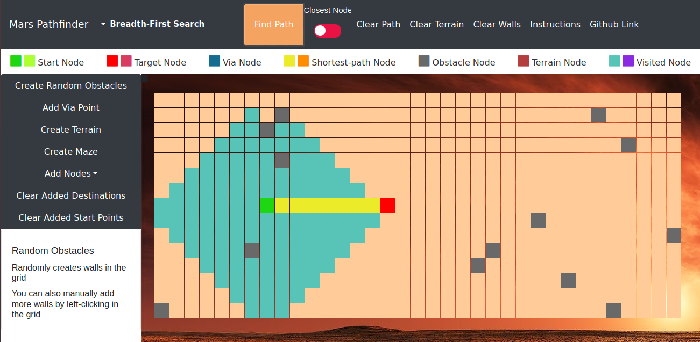

# Mars Pathfinder

A web application developed to navigate a Mars rover as a part of Microsoft Mars Colonisation Programme. Various pathfinding algorithms are used to find the shortest path between two points while avoiding obstacles on the way.  

[**Live demo !!**](https://marspathfinder.herokuapp.com/)

This provides insight into the behaviour of popular traversal algorithms, such as Depth-First Search (DFS), Breadth-First Search (BFS), Greedy Best First Search, Dijkstra's Algorithm and A* Search.
This visualisation tool was built using Vanilla Javascript, HTML5 Canvas and CSS.

## Algorithms 
This pathfinding algorithm visualizer uses the following algorithms to find a path on Mars
  - **A\* Search** 
  - **Dijkstra Algorithm** 
  - **Greedy Best First Search**
  - **Breadth First Search**
  - **Depth First Search**

## Features 
These are additional ways to explore Mars while travelling to your destination
  - **Random Obstacles**            - Generates random obstacles on the surface of Mars 
  - **Create Maze**                 - Uses Recursive Maze division to generate a maze 
  - **Via Point**                  - Traverse through a via point before reaching your destination
  - **Create Terrain**              - Simulates craters and mountains on Mars, manoeuvre your rover through them 
  - **Add Multiple Destinations**   - Creates multiple destination points for the rover 
  - **Add Multiple Start points**   - Creates multiple start points for the rover
  - **Closest Node**                
    - Finds the closest destination when multiple destinations are present 
    - Chooses one start point among many to reach the destination as quick as possible (simulating a multi agent system)
 - **Travelling Salesman Problem with multiple destinations**
    - Finds the optimal path to follow when there are multiple destinations 

## Instructions
 - Change the start and destination node positions by dragging
 - To draw walls, use left click
 - To delete walls, use right click
 - **Normal Pathfinding**
   - Toggle **Closest Path** to OFF 
   - Select the algorithm by using the dropdown list 
   - Click on **Find Path** for visualising the path followed by the rover 
 - **Complex Pathfinding**
   - Add multiple destinations or start nodes with via points for complex pathfinding    
   - Click on **Add Via point**, drag it to a suitable point and click **Find Path** 
   - Click on **Add Nodes**, then click on the surface to create _**an extra start or destination node**_. The user can click to add as many start or destination nodes as possible
   - Toggle the **Closest Node** button to GREEN for finding the closest path and to RED for TSP with multiple destinations
     - (**ON**) Travel to your **closest destination** on Mars either with **_multiple start or destination nodes_**
        - With multiple destination nodes, finds the closest destination
        - With multiple start nodes, chooses the closest start point to the destination
     - (**OFF**) Travel through all destinations optimally with the help of _Travelling Salesman Problem_
    - Click **Create Terrain** for simulating the Martian surface (paths with cost)
    - In the presence of TERAIN nodes, rover follows an optimal path to reach the destination minimising the cost 
    - Select the algorithm by using the dropdown list 
    - Finally, click on **Find Path** for visualising the path followed by the rover 
    
## Working
- Basic Pathfinding
  
- Pathfinding with Terrain
    
- MultiAgent for for choosing closest start node 
  
- Travelling Salesman Problem with multiple Destinations
  
  

### Team Martians
 - Gowri Lekshmy 
 - Shivani Chepuri
 - Samhita Kanaparthy
